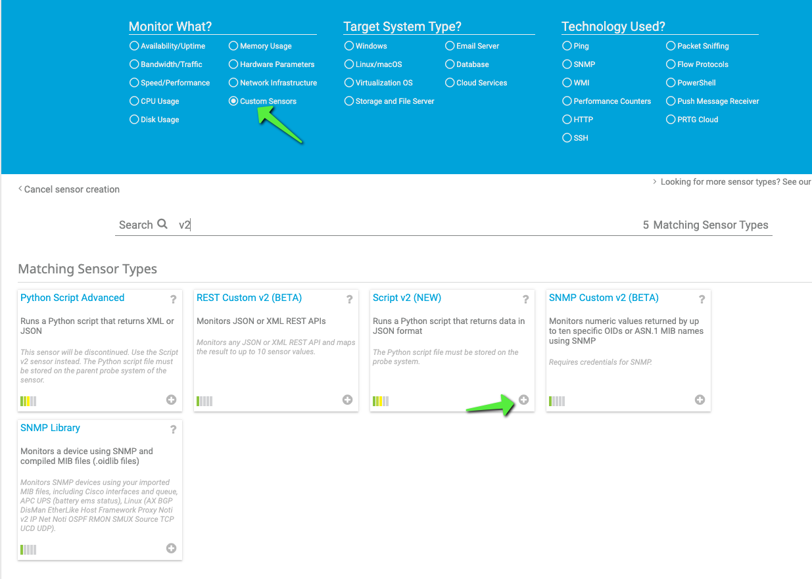
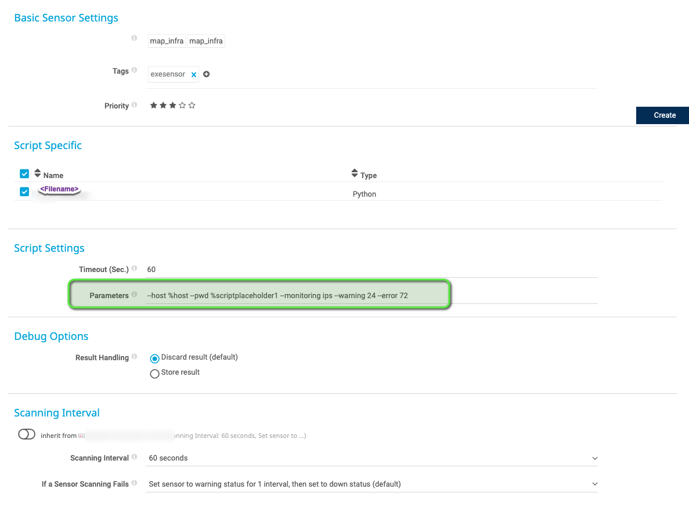
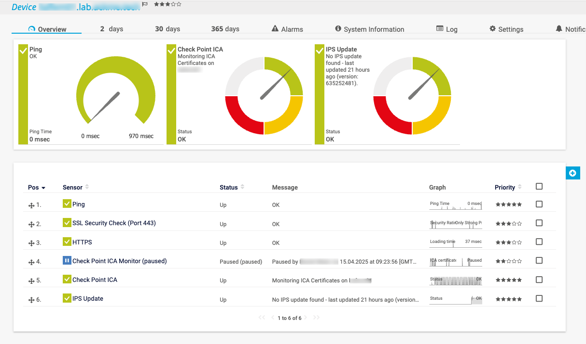

# py_cp-monitoring
Script for monitoring aspects of Check Point installation // Still in development!

## monitoring = "ica" 

connects to local management server, fetches ICA certificate and checks it´s expiration. Than fetches issued valid certificates and gives an output of:
Expiration of next certificate in days
Can trigger notification - depending on values of --warning / --error

## monitoring = "ips" 

issues "show-ips-status" api command and gives back information if there is an update, and when the last update has been successfully installed.
Can trigger notification - depending on values of --warning / --error

# goals for using this

This is for when having a monitoring system like Paessler PRTG or Nagios compatible having some aspects monitored by those systems and being notified if something is out of normal ranges. For example, when managing several Installations.

# Usage

Before being able to use this, please state "mode" inside of the script file. (arount row 10) This value does switch the script to "Nagios mode" or "PRTG Mode" (others might be added later, like Zabbix). This switches how output is generated and returned.


# Configuration (PRTG)

Place script file under PRTGs custom python sensor directory (default: C:\Programs\PRTG\Custom Sensors\scripts )
Create a new "Custom Advanced Python Sensor"



Configure the sensor according your needs:



Result:


According to help:
```
PS C:\Programs\PRTG\Custom Sensors\scripts> py .\py_cp-monitoring.py -h
Terminal detected
usage: py_cp-monitoring.py [-h] --host HOST [--user USER] --pwd PWD [--port PORT] [--context CONTEXT] [--monitoring {ica,emmclifetime,ips,licensing}] [--warning WARNING]
                      [--error ERROR] [--timeout TIMEOUT]

options:
  -h, --help            show this help message and exit
  --host HOST           The target to which the api requests are sent.
  --user USER           admin user to authenticate.
  --pwd PWD             admin pwd or API Key to authenticate.
  --port PORT           API Port Number
  --context CONTEXT     API Context name
  --monitoring {ica,emmclifetime,ips,licensing}
                        aspect to monitor
  --warning WARNING     threshold for warning state
  --error ERROR         threshold for error state
  --timeout TIMEOUT     The timeout in seconds.
```

## Configuration (Centreon) - not finished yet

Place the script under Monitoring Systems plugin folder (centreon default /usr/lib/centreon/plugins/) and configure a new check, using the script.

# Notice
This is also posted at Check Points Checkmates Community Toolbox
Please tell questions about it there
